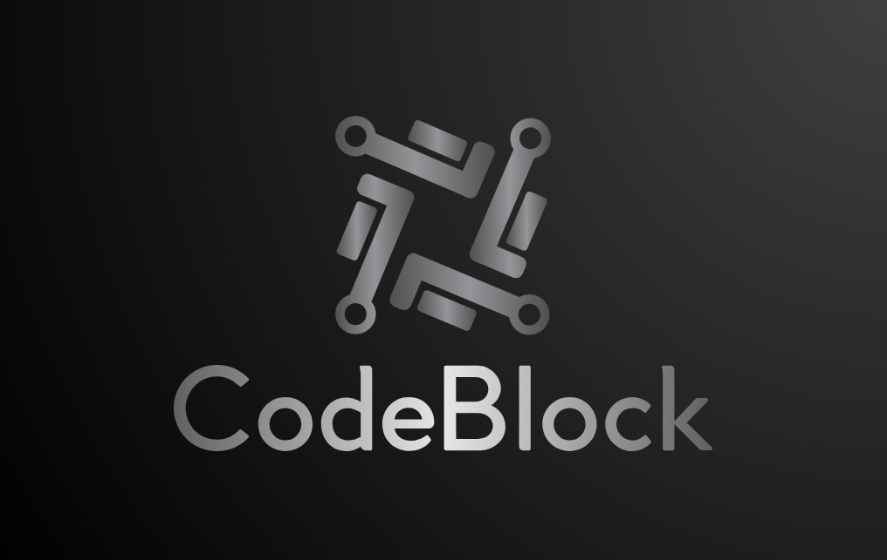
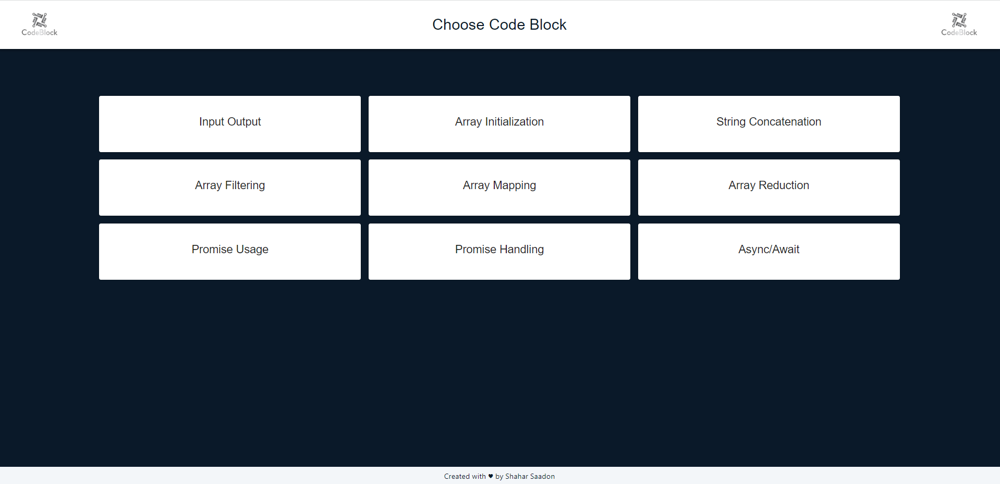
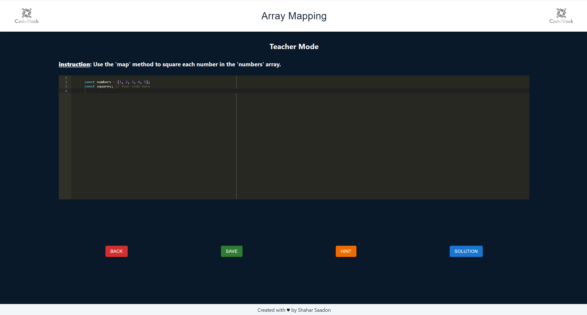
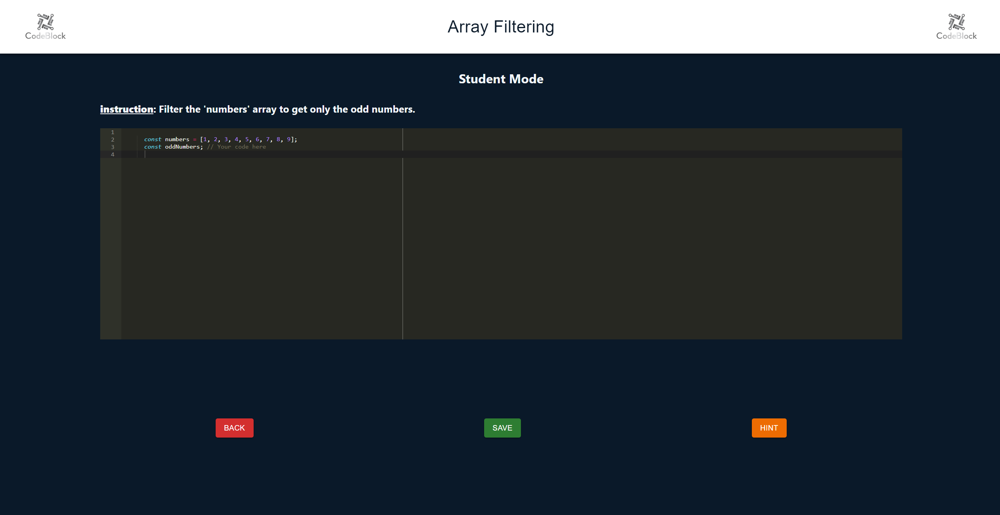
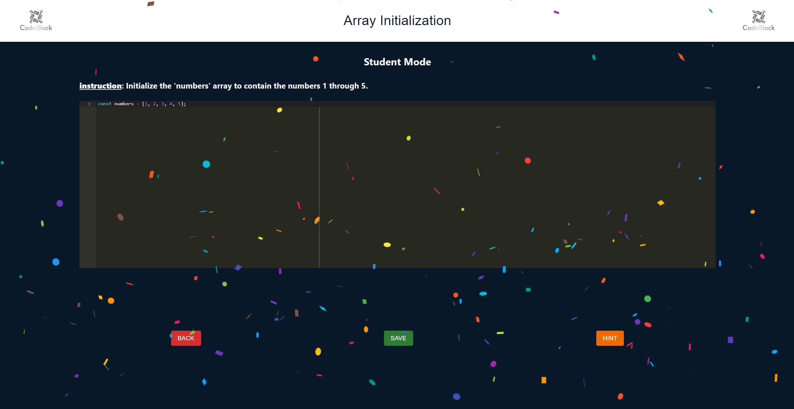
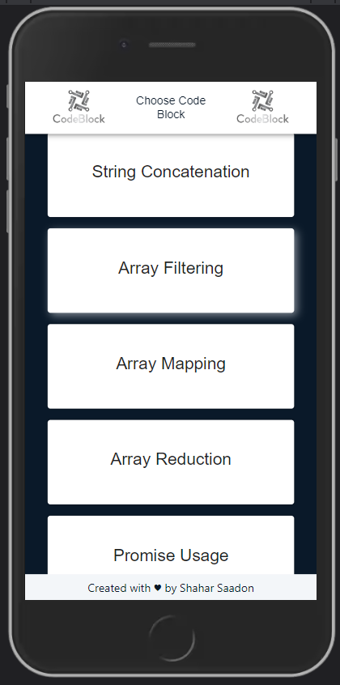
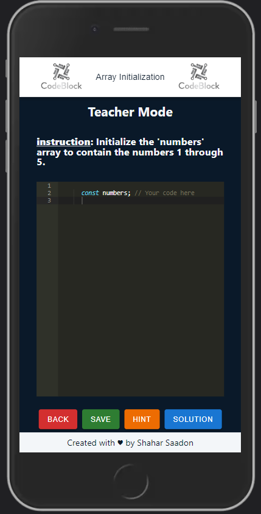
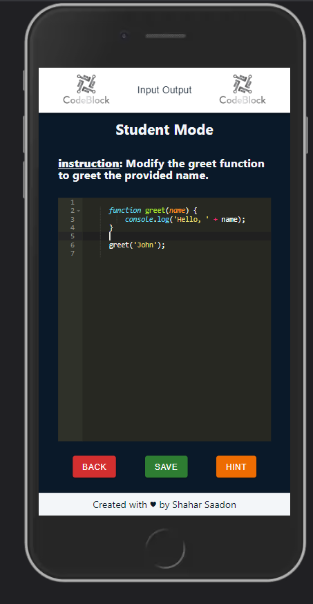
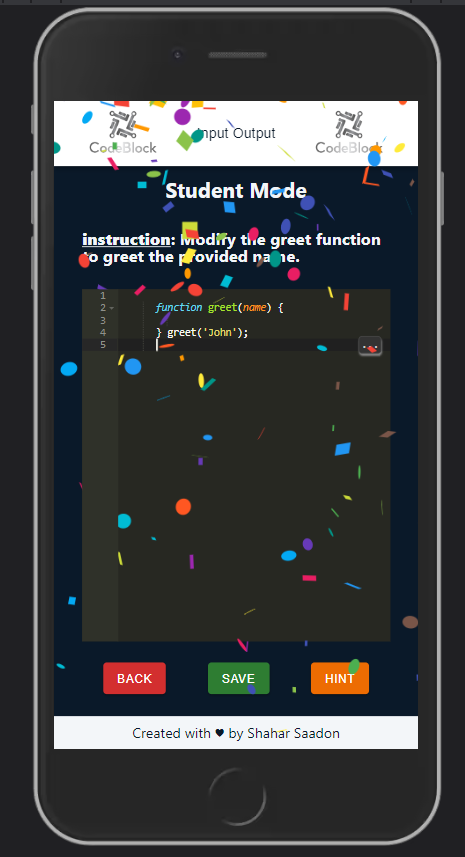

  

# CodeEditor

CodeEditor is a simple, real-time collaborative code editor built with React, Redux, and Socket.IO. It allows users to create code blocks, edit them in real-time, and share them with others. This project was created as part of a job interview assignment.

You can access the deployed application at https://code-editor-auw3.onrender.com/. (Please note that the initial loading may take few seconds due to the fact that is free server service.

## Navigation

- [Features](#features)
- [Technology Stack](#technology-stack)
- [Screenshots](#screenshots)
- [Mobile](#mobile)
- [Getting Started](#getting-started)

## Features
**Hint Option:** Users can access hints for the code block. Clicking on the "Hint" button opens a modal that displays a hint related to the code block.

**Live Code Updating**: As users type or modify code in the Ace Editor component, the changes are updated in real-time. This allows users to see the code updating dynamically without the need for manual refreshing.

**Student-Only Editing:** In "Student Mode," only the student has the ability to edit the code. The teacher can view and interact with the code but cannot modify it. This differentiation between teacher and student roles ensures proper code block management.

**Loader for Loading State:** When code blocks are being loaded, a loader component is displayed to indicate that the app is fetching data. This provides visual feedback to the user and prevents interaction with incomplete code block data.

**Responsive UI:** The app's user interface is designed to be responsive, adapting to different screen sizes and resolutions. This ensures a consistent and accessible experience across various devices and platforms.

**Navigation and Routing:** Users can navigate between different views using the app's navigation system, powered by React Router Dom. The use of routes and route parameters allows for seamless transitions between the Lobby and CodeBlock views.

**Clear User Interface Structure:** The user interface is organized into sections such as the main container, header, footer, cards container, code block container, etc. This clear structure enhances the user experience by providing a logical flow and visual hierarchy.

**Modal Dialogs:** The app utilizes modal dialogs for displaying additional information such as hints and solutions. These modal dialogs overlay the main content, ensuring focus and attention on the specific information being presented.

**Confetti for Correct Solution:** When the user's solution matches the correct solution for the code block, a confetti animation is displayed, providing visual feedback for a correct answer.

## Technology Stack

### Frontend
- React
- Redux
- React Rauter Dom
- Axios
- Scss
- MUI Material

### Backend
- Node.js
- Express
- MongoDB
- socket.io

## Screenshots

### Loby Page

The Lobby page displays the title "Choose code block" and a list of code block items. Clicking on an item directs the user to the corresponding code block page.

### Teacher Mode

In teacher mode, the mentor can view the selected code block in read-only mode, allowing them to observe the student's progress, while also having the option to request the solution if needed.

### Student Mode

In student mode, the user can actively modify the code within the selected code block. They also have the option to click a button and request hints directly within the application to receive guidance during the coding task.

### Correct Solution

When the user successfully enters the correct solution to the coding task, the screen goes wild with confetti. Because let's be honest, confetti it's much better than "smilie on the screen" :)

## Mobile

## Getting Started

### Prerequisites

Ensure you have the following installed on your local system:

- Node.js 14.0.0 or above
- npm 6.0.0 or above

### Setup

1. Clone the repository to a directory of your choice using `git clone https://github.com/ShaharSaadon/codeEditor.git`.
2. Navigate into the `codeEditor` directory.
3. Install server dependencies using `npm install`.
4. Navigate into the `client` directory using `cd client`.
5. Install client dependencies using `npm install`.
6. Run the server using `npm start` from the root directory.
7. Run the client using `npm run dev` from the `client` directory.

## Usage

Visit `http://localhost:5173` to view the application in your browser. If the application is running on a different port, make sure to update the server's core address accordingly.
